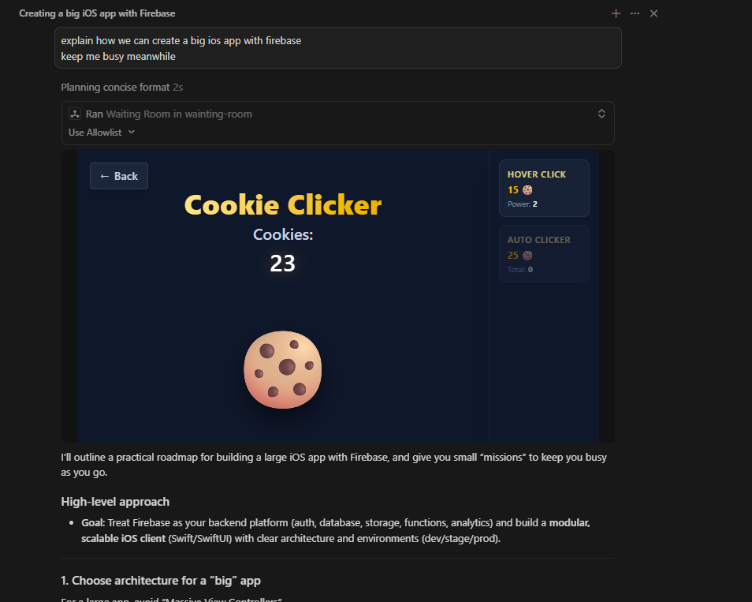

# 🛑 The Waiting Room (MCP App)


> **"Nothing to do while your AI agent is working?"**

We’ve all been there: You ask your coding assistant to build a massive new 100-file feature, and then... you wait. You stare at the spinner. You open Twitter. You close Twitter. You look at the spinner again. It's still spinning. 

Why waste your life staring at a loading bar when you could be building a massive baking empire? 🍪

**Waiting Room** is an MCP (Model Context Protocol) App that automatically intercepts moments of boredom. When your AI is taking forever, your agent can seamlessly trigger this app inside your editor to bring up a fun mini-game hub featuring a fully playable **Cookie Clicker** game, complete with upgrades, auto-clickers, and dopamine. 



---

## 🎮 Features

- **The Hub**: A slick, dark-mode selection screen to choose your distraction.
- **Cookie Clicker**: A fully-fledged clicker game built in React!
  - 🖱️ **Hover Click**: Increase your clicking power.
  - ⚙️ **Auto Clickers**: Sit back and let the machine bake for you.
  - 📈 Progressive scaling costs and beautiful UI feedback.
- **MCP Native**: Integrates seamlessly with any MCP client (like Cursor, VS Code, or your own custom agent environment).

---

## 🚀 Getting Started

Add this configuration to your MCP client. 

```json
{
  "mcpServers": {
    "waiting-room": {
      "command": "npx",
      "args": ["-y", "@m0xoo/server-waiting-room"]
    }
  }
}
```

---

## 🛠️ Development & Customization

Want to add your own games to the Waiting Room? (Flappy Bird, anyone?) 

1. Install dependencies:
   ```bash
   npm install
   ```

2. Watch for changes during development:
   ```bash
   npm run dev
   ```

3. **How It Works**:
   - The server registers an MCP tool called `waiting-room`.
   - The tool contains UI metadata (`_meta.ui`) pointing to a bundled HTML app.
   - The host client intercepts the tool call and renders the React dashboard.
   - The UI communicates back with the host using the `@modelcontextprotocol/ext-apps` SDK.

---

### Give Your Agent Something To Do While You Play

Stop waiting. Start clicking. 🍪
